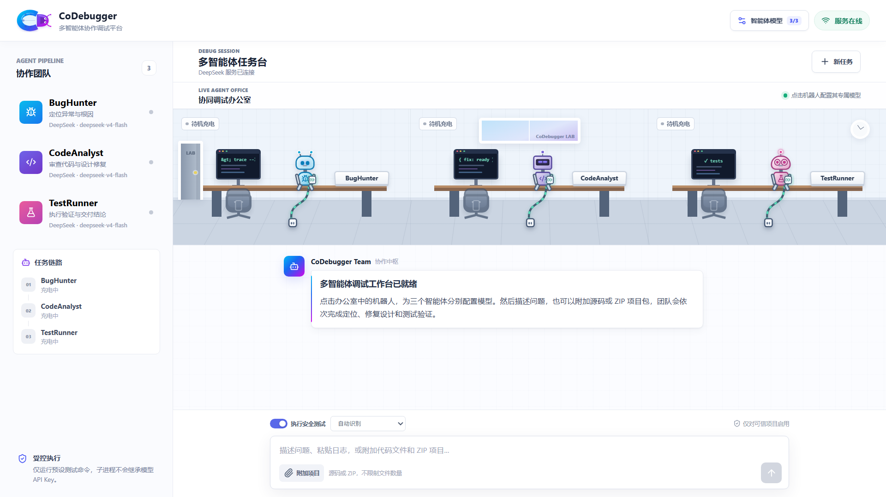

# CoDebugger

CoDebugger 是一个基于 React、TypeScript 与 FastAPI 的 AI 多智能体代码调试工作台。它通过 BugHunter、CodeAnalyst 与 TestRunner 三个真实模型阶段完成问题定位、修复设计和验证交付，并用可视化办公室呈现智能体工作与交接过程。

## 界面预览 / Interface Preview



> CoDebugger 多智能体协作调试工作台：展示 BugHunter、CodeAnalyst 和 TestRunner 的独立工位、模型状态、充电待机与任务协作界面。

## 名称与图标设计 / Naming and Icon

- **Code + Debugger**：`code-debugger` 表示这是一个面向代码问题定位、分析和修复的 Debug 工具。
- **Co + Debugger**：品牌名称采用 `CoDebugger`，其中 `Co` 代表 cooperation 与 collaboration，强调多个智能体、模型服务和调试工具的联合协同。
- **CD 虫形图标**：品牌图标把字母 `C` 和 `D` 组合成一只从顶部观察的虫子。较大的 `C` 构成虫子的身体与甲壳，较小的 `D` 构成带有双眼的头部，二者上下相连，既保留 `CD` 字母识别度，也直接呼应软件开发中的 Bug 与 Debug 概念。

The name combines two complementary meanings: **Code Debugger** describes the product as a code debugging tool, while **Co-Debugger** highlights coordinated work across multiple agents, model providers, and debugging tools. The artistic `CD` monogram forms a top-view bug: the larger `C` becomes the body and shell, and the smaller `D` becomes the head with two eyes, connecting the product identity directly to bugs and debugging.

## 已实现功能

- 真实三智能体流水线：`BugHunter → CodeAnalyst → TestRunner`，上游结论会作为下游智能体的任务上下文。
- `POST /api/chat/stream` 使用 SSE 持续推送阶段状态、模型 token、智能体交接、安全测试和完成事件。
- 办公室场景会随真实后端事件播放工作、敲击键盘、完成和携带任务包走向下一位智能体的动画。
- 点击任意机器人即可独立配置该智能体的供应商、模型和 API Key，三个智能体可以使用不同模型服务。
- 每 8 秒检查一次后端状态；后端未启动时明确显示“服务离线”，恢复后自动更新为在线。
- 支持阿里百炼、DeepSeek、MiniMax、小米 MiMo、Kimi 和智谱六家模型服务。
- 支持为每个智能体选择供应商、调整模型名称、填写 API Key，以及执行真实连接测试。
- API Key 使用密码输入框，后端仅返回大量遮蔽后的脱敏文本，不向浏览器回传明文。
- 用户填写的密钥只保存在当前后端进程内存中；后端重启后需要重新填写，避免写入浏览器缓存或项目文件。
- 模型连接测试使用独立的成功或失败弹窗，展示供应商、模型和可读的错误原因。
- 支持上传源码文件或 ZIP 项目包，后端会进行路径、类型、数量、体积和二进制安全检查后作为临时模型上下文。
- 支持 Markdown、GFM 表格、代码语法高亮、统一 Diff 样式和代码复制。
- 支持取消生成，并可选择受控测试命令；后端不使用 Shell，只允许预设命令且不会向子进程传递 API Key。
- 提供响应式桌面端和移动端界面，以及各供应商官方品牌图标。

## 项目结构

```text
codebugger/
├── backend/    FastAPI 后端、模型供应商配置和自动测试
└── frontend/   React + TypeScript + Vite 前端
```

## 环境配置

后端环境配置示例位于 `backend/.env.example`。默认 DeepSeek Key 可通过操作系统环境变量提供：

```dotenv
DEEPSEEK-APIKEY-CODEBUGGER=
DEEPSEEK_BASE_URL=https://api.deepseek.com
DEEPSEEK_MODEL=deepseek-v4-flash
DEEPSEEK_TIMEOUT_SECONDS=60
DEEPSEEK_TEMPERATURE=0.2
DEEPSEEK_MAX_TOKENS=2048
CONTEXT_MAX_BYTES=8388608
CONTEXT_PROMPT_MAX_CHARS=60000
CONTEXT_TTL_SECONDS=7200
TEST_EXECUTION_ENABLED=true
TEST_TIMEOUT_SECONDS=45
TEST_MAX_OUTPUT_CHARS=12000
```

不要提交真实的 API Key。`backend/.env`、依赖目录、缓存和构建产物均已加入 Git 忽略规则。

## 启动后端

需要 Python 3.11 或更高版本：

```powershell
cd backend
python -m venv .venv
.\.venv\Scripts\Activate.ps1
pip install -r requirements.txt
python -m uvicorn app.main:app --host 127.0.0.1 --port 8000
```

后端接口文档：`http://127.0.0.1:8000/docs`

## 启动前端

```powershell
cd frontend
npm install
npm run dev
```

默认前端地址：`http://127.0.0.1:5173`

Vite 会把 `/api` 请求代理到 `http://127.0.0.1:8000`。如需直连其他后端地址，可配置公开变量 `VITE_API_BASE_URL`，不要把 API Key 放入任何 `VITE_*` 变量。

## 主要接口

- `GET /api/health`：后端与当前模型状态。
- `GET /api/agents/model-config`：读取三位智能体的脱敏模型配置。
- `PUT /api/agents/{agent_id}/model-config`：更新指定智能体模型配置。
- `POST /api/agents/{agent_id}/model-config/test`：测试指定智能体模型连接。
- `POST /api/context`：上传源码文件或 ZIP 项目上下文。
- `POST /api/chat/stream`：执行三智能体任务并返回 SSE 流。

## 验证

```powershell
cd backend
pytest
ruff check .

cd ..\frontend
npm run lint
npm run build
```
